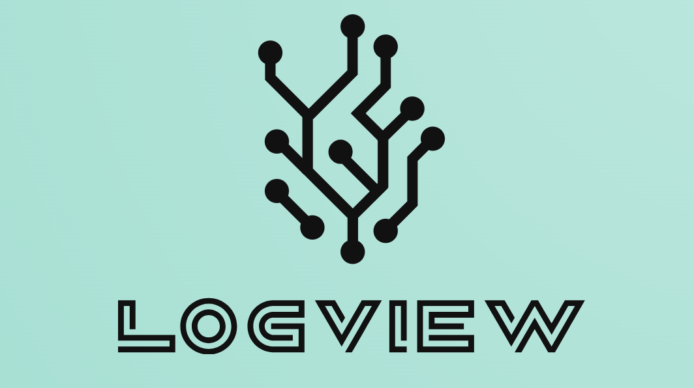

[](https://www.gnu.org/licenses/gpl-3.0)

<!-- PROJECT LOGO -->
<br />
<div align="center">
  <a href="https://github.com/othneildrew/Best-README-Template">
    
  </a>
</div>

## About The Project
We present you LogView, a framework to help process analysts validate the results of their queries and incrementally improve their knowledge of a log during their analysis. 
LogView keeps a record of the evaluated queries and results, and eases the comparison of different results with the intent of facilitating data understanding to analysts.
We implemented it as a Python library to help you integrate it into your existing process mining environments.

<p align="right">(<a href="#readme-top">back to top</a>)</p>


<!-- GETTING STARTED -->
## Getting Started

This is an example of how you may give instructions on setting up your project locally.
To get a local copy up and running follow these simple example steps.

### Prerequisites
LogView can be installed on Python 3.9.x / 3.10.x / 3.11.x / 3.12.x. 

This is an example of how to create a conda environment with python 3.10:
*
    ```sh
    conda create -n logview_env python=3.10
    conda activate logview_env
    ```

### Installation

LogView hasn't been uploaded to the Python Package Index yet. 
However, there's no need to worry! We can easily guide you through installing it locally in just two simple steps.

1. Clone the repo
   ```sh
   git clone https://github.com/blindreview-logview123/logview.git
   cd logview
   ```
2. Install LogView 
   ```sh
   python setup.py sdist bdist_wheel
   pip install .
   ```

If you wish to execute the examples in the notebook files, please ensure that you have 'ipykernel' installed in your Python environment.
* install `ipykernel` with pip 
    ```sh
    conda activate logview_env
    pip install ipykernel
    ```
<p align="right">(<a href="#readme-top">back to top</a>)</p>


<!-- USAGE EXAMPLES -->
## Usage

```python
from logview.utils import LogViewBuilder
log = ... #your reading logic for log files using pm4py
log_view = LogViewBuilder.build_log_view(log)

from logview.predicate import *
query = Query('my_query', [EqToConstant('Activity', 'Send for Credit Collection')])
result_set_query, complement_query = log_view.evaluate_query('traces_with_scc', log, query)
```

_For more examples, please refer to the examples in the directory [notebooks](https://example.com)_

<p align="right">(<a href="#readme-top">back to top</a>)</p>


<!-- CONTRIBUTING -->
## Contributing
If you have a suggestion that would make this better, please let us know it.
You can fork the repo and create a pull request. You can also simply open an issue with the tag "enhancement".

1. Fork the Project
2. Create your Feature Branch (`git checkout -b feature/AmazingFeature`)
3. Commit your Changes (`git commit -m 'Add some AmazingFeature'`)
4. Push to the Branch (`git push origin feature/AmazingFeature`)
5. Open a Pull Request
<p align="right">(<a href="#readme-top">back to top</a>)

<!-- LICENSE -->
## License
Distributed under the GPL-3.0 License. See `LICENSE.txt` for more information.
<p align="right">(<a href="#readme-top">back to top</a>)</p>
